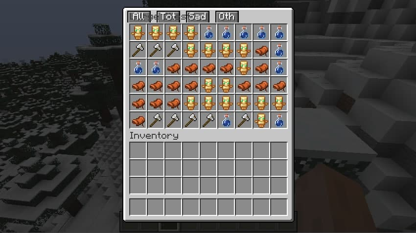
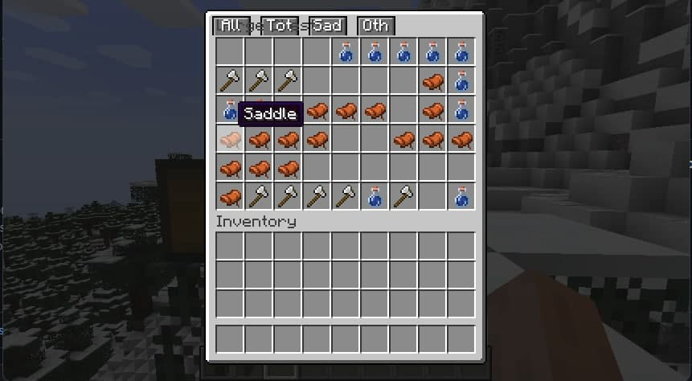

# AutoDropMod
A mod for Minecraft raid farm item classfication

## What is it?

This mod is used to deal with raid farm products that cannot be classified
Selectively throw out parts of the items as totem of undying and saddles

* Now available on Shulker Box(from 1.17)

这个mod是用来处理无法分类的袭击农场产物

可选择性扔出部分物品如图腾和鞍

* 现在支持潜影盒（从1.17）
## Picture / 效果图

(Before)

(After Clicking Tot Button)